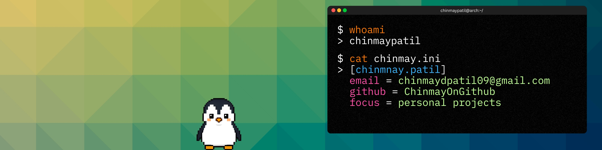

<!-- Image Banner -->

  

<!-- Intro -->
# Hey 👋, I'm Chinmay

Software developer crafting solutions with blockchain and modern web tech. When I'm not coding, you'll find me exploring Linux and tinkering with new technologies.

## About Me

- 🚀 Building my [personal site](https://portfolio-beta-sepia-45.vercel.app/)
- 🎓 CS student at Walchand College of Engineering, Sangli
- 🌱 Learning Next.js & modern deployment
- 💡 Ask me about Node.js, React, MongoDB, or Linux
- 📬 chinmaydpatil09@gmail.com

## Tech Stack

## Projects

### [VerifyHub: Certificate Verification System](https://github.com/ChinmayOnGithub/verifyhub-backend)

A practical solution for verifying educational certificates using blockchain.

- Smart contract-based verification
- PDF metadata injection with QR codes
- IPFS storage integration
- Simple verification codes for easy access

### [Stremora: Video Platform](https://github.com/ChinmayOnGithub/stremora-backend)

Video hosting platform with access control features.

- Video upload and streaming
- User authentication
- Access control
- Cloud storage integration

**Live Demo:** [stremora.vercel.app](https://stremora.vercel.app)

## Current Focus

- Next.js development and deployment
- Smart contract development
- System architecture
- Learning CI/CD and DevOps practices

## Coding Profiles

## GitHub Stats

  
  

<!--
  

    
  

-->
